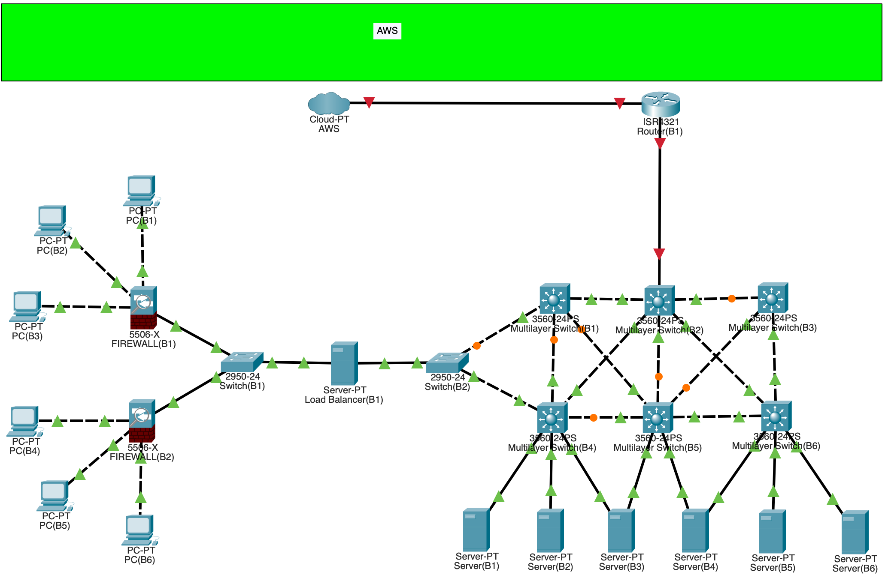

# Enterprise Network Architectural Design


### An Architectural Design from scratch

1. Having a Load Balancer before the firewall

```js
          PC -> Load Balancer -> Firewall -> Internal Network
                                       |
                                       +--> Switch -> Servers
                                       |
                                       +--> Router -> Cloud (Internet)

```

2. Having a Load Balancer after the firewall

```js
          PC -> Firewall -> Load Balancer -> Internal Network
                                       |
                                       +--> Switch -> Servers
                                       |
                                       +--> Router -> Cloud (Internet)
```
```js
Request made from PC will immediately hit a firewall 
filtering the traffic to be passed on to a load balancer 
which will decide which server should handle the request. 
It does this by by following predefined Algorithms 
sending traffic to the server with the fewest active connections. 
This allows us to have Scalibilty && High Availability
```

> `Still making adjustments to fit the business needs check back soon`

## 3 Cloud Providers

### CompuCloud


### AWS Cloud


### Azure Cloud


editing in progress
