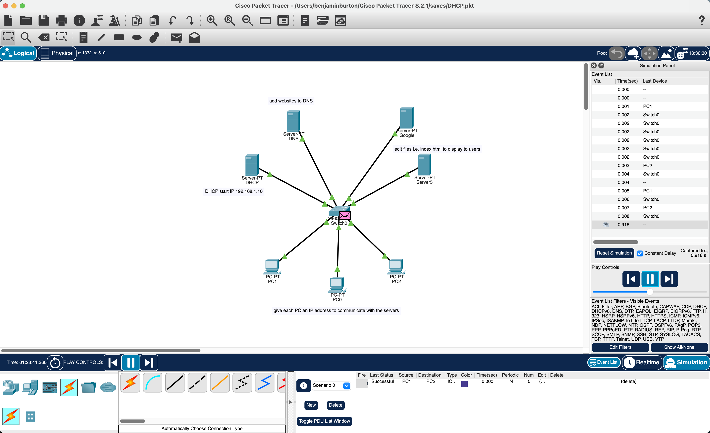

# DHCP HTTP DNS Server

give all servers an IP address and

inside the DHCP server turn off all services an turn on DHCP

set IP to the DNS inside the DHCP server

set start IP to 192.168.1.10

set PCs to DHCP

config the DNS server inside services and turn everything off

give the name of the website and the IP address 

select add to add it to the DNS (repeat for the other websites)

for the HTTP configuration inside services turn everything off (small simulations)

turn on the HTTP & HTTPS and edit files we want to show the user

save the file and select yes to overwrite to display the new file 
(repeat for the other websites)

select a PC and under desktop choose web browser to test the site

type in web address to see the chosen site 

# Under construction

