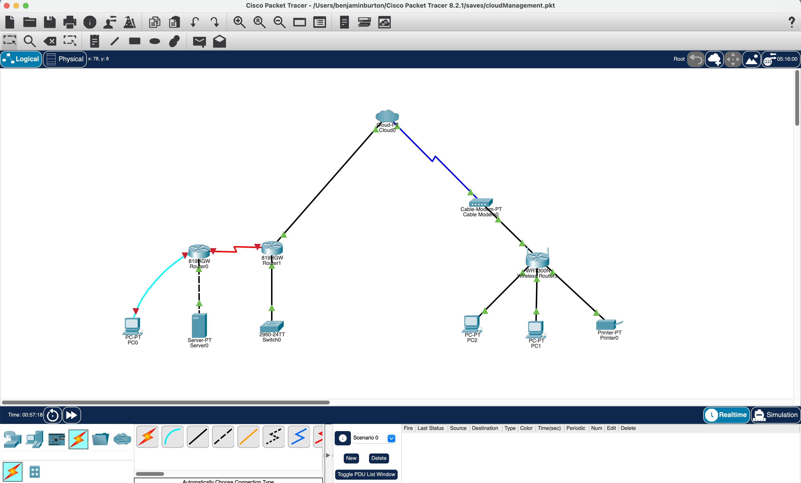

# Steps for a simple network topology using Cisco Packet Tracer:

 Add two `routers` and two `switches` to your `topology`.

 Connect each `router` to a `switch` using an `Ethernet` cable.
Configure the routers with `IP addresses` on the same `subnet` (e.g., 192.168.1.1 and 192.168.1.2).

 Configure the `switches` with `VLANs` and assign `ports` to the appropriate `VLANs`.

 Connect a `PC` to each `switch` using a `Ethernet` cable.

 Configure the `PCs` with `IP addresses` on the same `subnet` as the `routers` (e.g., 192.168.1.3 and 192.168.1.4).

 Configure the `routers` to use a routing `protocol` (such as `OSPF`) to communicate with each other.

 Test the network by `pinging` the `PCs` from each other and verifying that the `packets` are received.

 These are the steps and configurations for specific network requirements.

## Under Construction

