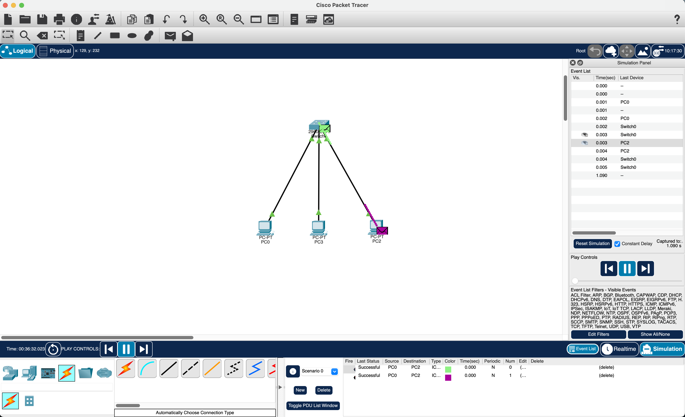

# Star Topology

With a star topology you want to add 3 PCs and a router

give the PCs IP addresses so they can communicate with each other

add a router and connect the PCs with a straight through cable

test a packet by sending to two PCs an place into simulation mode to see if everything is working.

