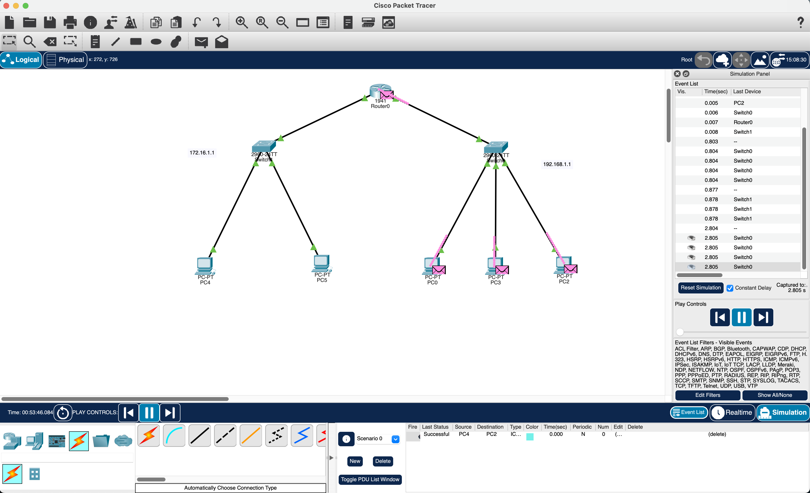

# Two Switches connected

From the previous step we added another switch and two more PCs

give PCs IP addresses

connect the PCs to the new switch ( use copper straight-through )

connect the new switch to the previous switch ( use copper cross-over cable )

give the router its IP configs and turn the port on

give each PC a default gateway to connect 
( 192.168.1.1 PCs to 172.16.1.1 and vice versa )

ping the PCs to check the connections

send packets in simulation mode to test

whats happening is first the IP is checking if its connected to itself 
then go to the router an check the IP address then go to the PC an say yes
we have this IP address then go back to the router then back to the switch then back to the IP its meant to be sent

